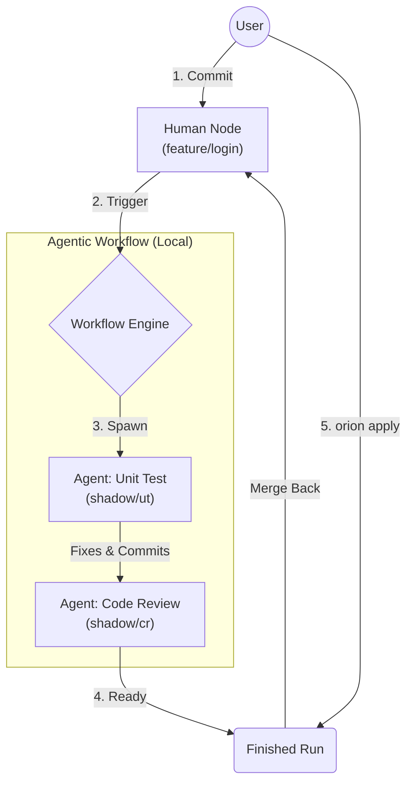

#  Orion: AI-Native Development Environment Manager

[](https://golang.org/dl/)
[](LICENSE)

[**English**](README.md) | [**简体中文**](README_zh-CN.md)

**Orion** is a CLI tool designed for the **Agentic DevOps** era. It virtualizes your local development environment, allowing you to collaborate with AI Agents as if they were teammates sitting next to you.

## 🌌 Why "Orion"?

**Orion** is a navigation system for AI agents. The name symbolizes how **Orion orchestrates agents across your codebase**, guiding them through complex development tasks like the constellation guides a navigator.

---

## 🌟 Core Concept: Agentic DevOps

Traditional DevOps relies on remote CI/CD pipelines—slow, stateless, and disconnected from your IDE.

**Orion brings the pipeline to your local machine.** It introduces the concept of **Nodes**:

- **Human Node**: Your dedicated workspace (Git Worktree + Tmux Session).
- **Agentic Node**: An ephemeral workspace where AI Agents running in the background can write code, run tests, and fix bugs _concurrently_ with you.

### The "Chain of Branch" Workflow

Instead of blocking your work, Orion orchestrates a chain of **Shadow Branches**:



1.  **You Code**: Work in your Human Node.
2.  **Agents React**: On every commit, Orion spins up Agent Nodes.
3.  **Parallel Execution**: While you continue coding, Agent 1 writes tests, Agent 2 reviews code.
4.  **Loop Closed**: You use `orion apply` to merge the Agents' work back into your branch when you are ready.

---

## 🚀 Quick Start

### Installation

**One-Click Install (Recommended)**

```bash
curl -fsSL https://raw.githubusercontent.com/bytedance/Orion/main/install.sh | bash
```

**Manual Install**

See [Installation Guide](user-guide/installation.md) for building from source.

### Usage

#### 1. Initialize

```bash
mkdir myproject_swarm && cd myproject_swarm
orion init https://github.com/user/repo.git
```

#### 2. Start Coding (Human Node)

```bash
# Create a node for your feature
orion spawn feature/login login-dev

# Enter the isolated environment
orion enter login-dev
```

#### 3. Agent Collaboration

When you commit code in `login-dev`, a workflow starts automatically.

```bash
# Check agent status
orion workflow ls

# Inspect what the agent did
orion workflow inspect <run-id>

# Merge agent's changes back to your node
orion apply login-dev
```

---

## 📚 Documentation

- [**Installation Guide**](user-guide/installation.md): Requirements and setup.
- [**Human Node Guide**](user-guide/human-node.md): Managing your workspace and VSCode integration.
- [**Agentic Workflow Guide**](user-guide/workflow.md): Configuring agents, triggers, and the apply loop.

---

## 🛠 Tech Stack

- **Golang**: Core logic and CLI (Cobra).
- **Git Worktree**: File system isolation.
- **Tmux**: Process and session isolation.
- **Qwen**: The AI engine powering the automation.

## License

Apache License 2.0
