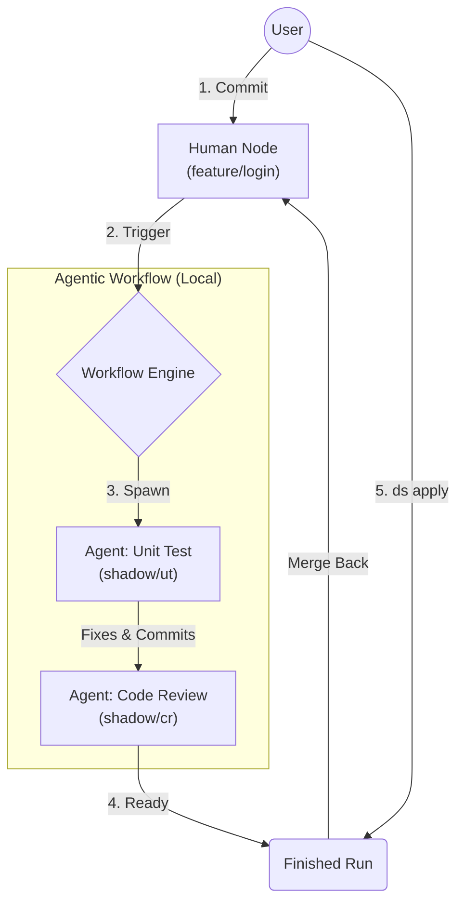

# DevSwarm: AI 原生开发环境管理器

[](https://golang.org/dl/)
[](LICENSE)

[**English**](README.md) | [**简体中文**](README_zh-CN.md)

**DevSwarm** 是专为 **Agentic DevOps** 时代设计的 CLI 工具。它虚拟化了你的本地开发环境，让你能够与 AI Agents 像队友一样协同工作。

---

## 🌟 核心理念：Agentic DevOps

传统的 DevOps 依赖于远程 CI/CD 流水线——这通常是缓慢、无状态且与你的 IDE 断连的。

**DevSwarm 将流水线带回了本地。** 它引入了 **Node (节点)** 的概念：
*   **Human Node (人类节点)**: 你的专属工作区 (Git Worktree + Tmux Session)。
*   **Agentic Node (智能体节点)**: 一个临时的后台工作区，AI Agents 可以在其中与你 *并发* 地编写代码、运行测试和修复 Bug。

### "Chain of Branch" 工作流

DevSwarm 不会阻塞你的工作，而是编排一条 **Shadow Branch (影子分支)** 链：



1.  **你编码**: 在 Human Node 中工作。
2.  **Agent 响应**: 每次提交都会自动触发 Agent Node。
3.  **并行执行**: 当你继续编码时，Agent 1 编写测试，Agent 2 审查代码。
4.  **闭环**: 当你准备好时，使用 `ds apply` 将 Agent 的成果合并回你的分支。

---

## 🚀 快速开始

### 安装

**一键安装 (推荐)**

```bash
curl -fsSL https://raw.githubusercontent.com/bytedance/DevSwarm/main/install.sh | bash
```

**手动安装**

如需源码构建，详见 [安装指南](user-guide/installation_zh-CN.md)。

### 使用

#### 1. 初始化
```bash
mkdir myproject_swarm && cd myproject_swarm
ds init https://github.com/user/repo.git
```

#### 2. 开始编码 (Human Node)
```bash
# 为你的特性创建一个节点
ds spawn feature/login login-dev

# 进入隔离环境
ds enter login-dev
```

#### 3. Agent 协作
当你在 `login-dev` 中提交代码时，工作流会自动开始。

```bash
# 查看 Agent 状态
ds workflow ls

# 检查 Agent 做了什么
ds workflow inspect <run-id>

# 将 Agent 的更改变更回你的节点
ds apply login-dev
```

---

## 📚 文档

- [**安装指南**](user-guide/installation_zh-CN.md): 环境要求与设置。
- [**Human Node 指南**](user-guide/human-node_zh-CN.md): 管理工作区与 VSCode 集成。
- [**Agentic Workflow 指南**](user-guide/workflow_zh-CN.md): 配置 Agent、触发器与回归闭环。

---

## 🛠 技术栈

- **Golang**: 核心逻辑与 CLI (Cobra)。
- **Git Worktree**: 文件系统隔离。
- **Tmux**: 进程与会话隔离。
- **Qwen**: 驱动自动化的 AI 引擎。

## License

Apache License 2.0
